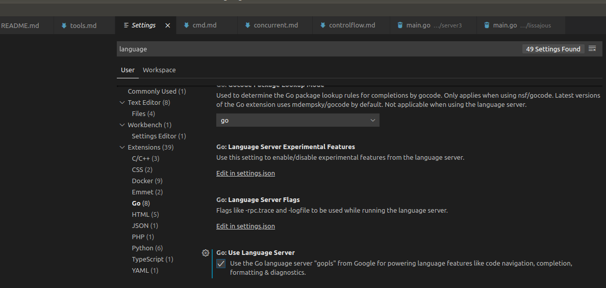

# go get
Get downloads the packages named by the import paths, along with their dependencies. It then installs the named packages, like 'go install'.e.g. go get -u -v 

Without that flag -u, packages that already exist locally will not be updated.

# go build
用于编译package main,其他package 只是检查一下编译错误。

其他工程化设计：
* go build会忽略目录下以“_”或“.”开头的go文件。
* 如果你的源代码针对不同的操作系统需要不同的处理，那么你可以根据不同的操作系统后缀来命名文件。例如有一个读取数组的程序，它对于不同的操作系统可能有如下几个源文件：
array_linux.go array_darwin.go array_windows.go array_freebsd.go
go build的时候会选择性地编译以系统名结尾的文件（Linux、Darwin、Windows、Freebsd）。例如Linux系统下面编译只会选择array_linux.go文件，其它系统命名后缀文件全部忽略。

# go install
适用于main以外的pacakge,
The go install command is very similar to go build, except that it saves the compiled code for each package and command instead of throwing it away. Compiled packages are saved beneath the $GOPATH/pkg directory corresponding to the src directory in which the source resides, and command executables are saved in the $GOPATH/bin directory. 

to cross-compile a Go program,Just set the **GOOS** or **GOARCH** env variables during the build.

#  go list
reports information about available packages


# go doc
类似 linux/c用的man

```bash
$ go doc builtin
$ go doc fmt println
$ go doc image/color  Color
$ go doc io.Copy

```
go doc 工具会从 Go 程序和包文件中提取顶级声明的首行注释以及每个对象的相关注释，并生成相关文档。golang.org 就是通过这种形式实现的。

# go test
Go语言中自带有一个轻量级的测试框架testing和自带的go test命令会自动读取源码目录下面名为*_test.go的文件，生成并运行测试用的可执行文件。默认的情况下，不需要任何的参数，它会自动把你源码包下面所有test文件测试完毕，当然你也可以带上参数，详情请参考go help testflag

Within *_test.go files, three kinds of functions are treated specially : 
* tests, 
* benchmarks, and
* examples. 

The go test tool has built-in support for several kinds of profiling.
```bash
$ go test -cpuprofile=cpu.out
$ go test -blockprofile=block.out
$ go test -memprofile=mem.out
$ go tool pprof -text -nodecount=10 ./http.test cpu.log
```

## 3rd party: gotest
gotests插件自动生成测试代码:

```bash
go get -u -v github.com/cweill/gotests/...
```
安装后，VS code 就可以选定一个 function 然后让他自动生成 unit test case 和benchmark test；test case 也可以在VS code 中选择执行。

# go clean
本地如果用git管理的话，不如用git clean 来处理

# go fmt
go fmt <文件名>.go，你的代码就被修改成了标准格式

# go tool
go tool下面下载聚集了很多命令，这里我们只介绍两个，fix和vet
    go tool fix . 用来修复以前老版本的代码到新版本，例如go1之前老版本的代码转化到go1,例如API的变化
    go tool vet directory|files 用来分析当前目录的代码是否都是正确的代码,例如是不是调用fmt.Printf里面的参数不正确，例如函数里面提前return了然后出现了无用代码之类的。 类似 https://github.com/golang/lint

# go generate
这个命令是从Go1.4开始才设计的，通过分析源码，找出所有包含\"//go:generate\"的特殊注释，提取并执行该特殊注释后面的命令，命令为可执行程序，形同shell下面执行。


# go help
这是对go 命令的帮助信息

```bash
$ go help get
usage: go get [-d] [-f] [-t] [-u] [-v] [-fix] [-insecure] [build flags] [packages]

$ go help packages
Many commands apply to a set of packages:

	go action [packages]

```
# install some cmd after gfw
```bash
go/src/golang.org/x$ git clone https://github.com/golang/tools.git
$ go install golang.org/x/tools/cmd/godoc
$ go install golang.org/x/tools/cmd/guru
$ go install golang.org/x/tools/cmd/gorename
$ go install golang.org/x/tools/cmd/fiximports
$ go install golang.org/x/tools/cmd/godex
$ gopls version
```

# godoc
由于https://golang.org/国内没法访问，只能启动godoc

```bash
$ godoc -http=:8080 &
[1] 25294
```
然后在浏览器中可以看到自己写的程序跟builtin同等地位，godoc 就是将　GOPATH，GOROOT下的所有exported 的注释显示出来。当然,有的包只是提供注释
```bash
alex@minipc:/usr/lib/go/src/builtin$ cat builtin.go 
// Copyright 2011 The Go Authors. All rights reserved.
// Use of this source code is governed by a BSD-style
// license that can be found in the LICENSE file.

/*
	Package builtin provides documentation for Go's predeclared identifiers.
	The items documented here are not actually in package builtin
	but their descriptions here allow godoc to present documentation
	for the language's special identifiers.
*/
package builtin
```
# gopl
```bash
src/golang.org/x$ git clone https://github.com/golang/tools.git
src/golang.org/x$ git clone https://github.com/golang/sync
src/golang.org/x$ go get -v golang.org/x/tools/gopls
```


# objdum
```bash
 $ go build main.go 
 $ go tool objdump main > obj.s
 $ cat obj.s
```
