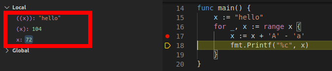

就像学外语一样，死记硬背语法是一个方法，模仿成正确的习惯也是一种方法。

这里就记录一些有趣的例子

1. package 可以说是source code file的逻辑名，同一目录下多个source code file 只要用同样的package name，那就跟合成一个文件没区别。不用**include**啦。Packages in Go serve the same purposes as libraries or modules in other languages, supporting modularity, encapsulation, separate compilation, and reuse.
2. The zero-value mechanism ensures that a var iable always holds a wel l-define d value of its typ。加上the init function mechanism 就不用**c++ constructor** 啦.
3. 支持tuple assignment，**c++ tuple**类型就没有必要了。
4. With a pointer, we can read or update the value of a variable **indirectly**, without using or even knowing the name of the variable, if indeed it has a name. pointer of 像是综合了**pointer of c 的写法和reference in C++的用法**. 
5. local variables have dynamic lifetimes。 A compiler may choose to allocate local variables on the heap or on the stack but, perhaps surprisingly, this choice is not detemined by whether var or new was used to declare the variable. 也就是说，程序员不用操心，一个func可以返回其locall variable,放心用，gc不会愚蠢的recycle其占用空间。Garbage collection is a tremendous help in writing correct programs, but it does not relieve you of the burden of thinking about memory. You don’t need to explicitly allocate and free memory, but to write efficient programs you still need to be aware of the lifet ime of variables.For example, keeping unnecessary pointers to short-lived objects within long-lived objects,especially global variables, will prevent the garbage collector from reclaiming the short-lived objects.
7. go 一方面是strict type, “type Celsius float64” 就定义了一种新type,不允许自动转换；另外一方面 In any case, a conversion never fails at run time.
8. 虽然go 没有c++中class概念，但任何named type都可以看成一个class
> func (c Celsius) String() string { return fmt.Sprintf("%g°C", c) }
9. package level 的varialbe,如果不是大写字母开头，类似**static variable in C**.
10. Go’s types fall into four categories: basic types, aggregate types, reference types, and interface types. 前两种各种语言都差不多。Reference types are a diverse group that includes pointers,slices, maps, **functions**, and channels , but what they have in common is that they all refer to program variables or state **indirectly**, so that the effect of an operation applied to one reference is observed by all copies of that reference.
11. 


note:

1. C++ References are often confused with pointers, but three major differences between references and pointers are 
   - You cannot have NULL references. You must always be able to assume that a reference is connected to a legitimate piece of storage.
   - Once a reference is initialized to an object, it cannot be changed to refer to another object.  Pointers can be pointed to another object at any time.
   - A reference must be initialized when it is created. Pointers can be initialized at any time.2.
2. a good exmpale of scope



3. printf也是有差异的
```go
	unicode := '国'
	fmt.Printf("%d %[1]c %[1]q\n", unicode) // "22269 国 '国'"
```   
4. abc
     


