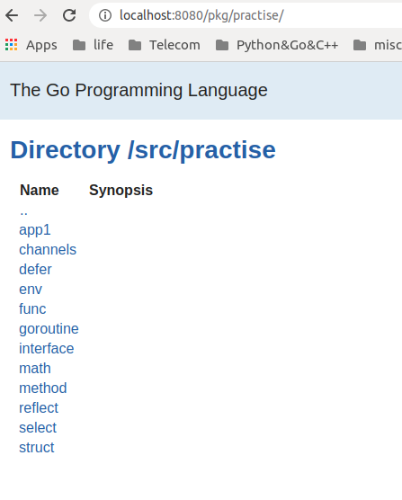

由于golang.org 国内没法访问，只能启动godoc
```bash
$ godoc -http=:8080 &
[1] 25294
```
然后在浏览器中可以看到


这可以说是godoc 非常有趣的一点，自己写的程序跟builtin同等地位，godoc 就是将　GOPATH，GOROOT下的所有exported 的注释显示出来。

可能go设计时有代码、文档在一起的思想。

```bash
$ go env
GOARCH="amd64"
GOBIN=""
GOCACHE="/home/alex/.cache/go-build"
GOEXE=""
GOHOSTARCH="amd64"
GOHOSTOS="linux"
GOOS="linux"
GOPATH="/home/alex/base/go"
GORACE=""
GOROOT="/usr/lib/go-1.10"

$ ls /usr/lib/go-1.10/src
all.bash          bootstrap.bash  bytes       cmp.bash   crypto    errors  go     index         log        math           net     race.bash  run.bash  strconv  testing  unsafe
all.bat           bufio           clean.bash  compress   database  expvar  hash   internal      make.bash  mime           os      race.bat   run.bat   strings  text     vendor
androidtest.bash  buildall.bash   clean.bat   container  debug     flag    html   io            make.bat   naclmake.bash  path    reflect    runtime   sync     time
archive           builtin         cmd         context    encoding  fmt     image  iostest.bash  Make.dist  nacltest.bash  plugin  regexp     sort      syscall  unicode
```