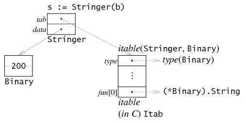

# struct
alex: 也是类似C++，struct 中的所有字段都是public的？

这里有一个问题：如果human里面有一个字段叫做phone，而student也有一个字段叫做phone，那么该怎么办呢？

Go里面很简单的解决了这个问题，最外层的优先访问，也就是当你通过student.phone访问的时候，是访问student里面的字段，而不是human里面的字段。

这样就允许我们去重载通过匿名字段继承的一些字段，当然如果我们想访问重载后对应匿名类型里面的字段，可以通过匿名字段名来访问。请看下面的[例子](https://github.com/yc-alex-xu/go/tree/master/src/practise/struct)
* main.go   普通struct
* anonym.go  嵌套了匿名field
* override.go   覆盖 嵌套的struct 中定义


# method
[code](https://github.com/yc-alex-xu/go/tree/master/src/practise/method)
* main.go：　普通
* inherit.go 　继承
* override.go   覆盖

method是附属在一个给定的类型上的，他的语法和函数的声明语法几乎一样，只是在func后面增加了一个receiver(也就是method所依从的主体)。你可以在任何的自定义类型中定义任意多的method
## method继承
前面一章我们学习了字段的继承，那么你也会发现Go的一个神奇之处，method也是可以继承的。如果匿名字段实现了一个method，那么包含这个匿名字段的struct也能调用该method。让我们来看下面这个例子

## method重写

上面的例子中，如果Employee想要实现自己的SayHi,怎么办？简单，和匿名字段冲突一样的道理，我们可以在Employee上面定义一个method，重写了匿名字段的方法

# interface
Go语言里面设计最精妙的应该算interface，它让面向对象，内容组织实现非常的方便，当你看完这一章，你就会被interface的巧妙设计所折服。

简单的说，interface是一组method签名的组合，我们通过interface来定义对象的一组行为。

[example code](https://github.com/yc-alex-xu/go/tree/master/src/practise/interface)
* main.go
* stringer.go: Stringer interface 类型的参数
* type.go ：　判断interface 对象的类型

interface可以被任意的对象实现。我们看到上面的Men interface被Human、Student和Employee实现。同理，一个对象可以实现任意多个interface，例如上面的Student实现了Men和YoungChap两个interface。

Alex：感觉interface 就突破了class 之间的继承关系。

## 空interface
interface{}不包含任何的method，正因为如此，所有的类型都实现了空interface。空interface对于描述起不到任何的作用(因为它不包含任何的method），但是空interface在我们需要存储任意类型的数值的时候相当有用，因为它可以存储任意类型的数值。它有点类似于C语言的void*类型 (alex:interface 类似引用？)。
```go
// 定义a为空接口
var a interface{}
var i int = 5
s := "Hello world"
// a可以存储任意类型的数值
a = i
a = s
```

## interface作为参数
```bash
$ godoc fmt Println
use 'godoc cmd/fmt' for documentation on the fmt command 

func Println(a ...interface{}) (n int, err error)
    Println formats using the default formats for its operands and writes to
    standard output. Spaces are always added between operands and a newline
    is appended. It returns the number of bytes written and any write error
    encountered.
    
```
据说只要它的参数
```go
type Stringer interface {
	 String() string
}
```


## interface的实现：
作为一门编程语言，对方法的处理一般分为两种类型：一是将所有方法组织在一个表格里，静态地调用（C++, java）；二是调用时动态查找方法(python, smalltalk, js)。
而go语言是两者的结合：虽然有table，但是是需要在运行时计算的table。

e.g.
Binary类实现了两个方法，String()和Get(), 由于它实现了String()，按照golang的隐式方法实现来看，Binary satisfied了Stringer接口。因此它可以赋值： s:=Stringer(b)。

一个interface值由两个指针组成，
* tab：指向一个interface table，叫 itable。itable开头是一些描述类型的元字段，后面是一串方法。注意这个方法是interface本身的方法，并非其dynamic value（Binary）的方法。即这里只有String()方法，而没有Get方法。但这个方法的实现肯定是具体类的方法，这里就是Binary的方法。当这个interface无方法时，itable可以省略，直接指向一个type即可。
* data： 指向dynamic value的一个拷贝，这里则是b的一份拷贝。也就是，给interface赋值时，会在堆上分配内存，用于存放拷贝的值。同样，当值本身只有一个字长时，这个指针也可以省略。
 
 

element.(type) 相当于 element.tab->type

## interface的嵌入
e.g. io包下面的 io.ReadWriter ，它包含了io包下面的Reader和Writer两个interface,也就将它们所有method给隐式的包含进来了

```go
// io.ReadWriter
type ReadWriter interface {
	Reader
	Writer
}
```

# reflect
所谓反射就是能检查程序在运行时的状态。我们一般用到的包是reflect包。使用reflect一般分成三步

[example of reflect](https://github.com/yc-alex-xu/go/blob/master/src/practise/reflect/main.go)